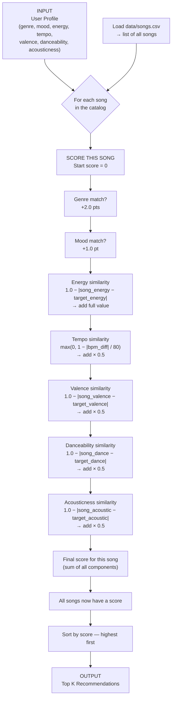

# 🎵 Music Recommender Simulation

## Project Summary

In this project you will build and explain a small music recommender system.

Your goal is to:

- Represent songs and a user "taste profile" as data
- Design a scoring rule that turns that data into recommendations
- Evaluate what your system gets right and wrong
- Reflect on how this mirrors real world AI recommenders

Replace this paragraph with your own summary of what your version does.

---

## How The System Works

Real-world recommenders take a user taste profile and compare it against each song in the catalog, then rank the songs by how well they match. This simulation follows that pattern: it scores each song individually and then sorts the scored songs to produce the final recommendations.

### Data Flow

- **Input:** `UserProfile` — the user's favorite genre, mood, energy level, tempo, valence, danceability, and acousticness preferences
- **Process:** load every song from `data/songs.csv`, then loop through each song individually and compute a compatibility score against the user profile
- **Output:** sort all scored songs by descending score and return the top K recommendations

The flowchart below traces the journey of **one song** from the CSV file to its place in the ranked list:



### Algorithm Recipe

Each song is scored individually. The components are added together to produce a single number:

| Feature | Formula | Weight |
| --- | --- | --- |
| Genre match | `+2.0` if `song.genre == user.favorite_genre` | fixed |
| Mood match | `+1.0` if `song.mood == user.favorite_mood` | fixed |
| Energy | `1.0 − abs(song.energy − user.target_energy)` | ×1.0 |
| Tempo | `max(0, 1.0 − abs(song.tempo_bpm − user.preferred_tempo) / 80)` | ×0.5 |
| Valence | `1.0 − abs(song.valence − user.target_valence)` | ×0.5 |
| Danceability | `1.0 − abs(song.danceability − user.preferred_danceability)` | ×0.5 |
| Acousticness | `1.0 − abs(song.acousticness − user.preferred_acousticness)` | ×0.5 |

The similarity formula `1.0 − abs(a − b)` rewards closeness: a perfect match scores 1.0, a total mismatch scores 0.0. Genre and mood use fixed bonuses instead because they are categorical, not numeric.

### Why Both Rules Matter

- A **Scoring Rule** decides how compatible a single song is with the user.
- A **Ranking Rule** takes all those individual scores and orders the songs so the best matches appear first.

### Potential Biases

- **Genre dominance:** A genre match awards +2.0 — the largest single bonus. A song in the wrong genre but otherwise perfect on every numeric feature will almost always lose to a genre match, even if that genre match sounds nothing like what the user wants.
- **Mood dominance:** The +1.0 mood bonus similarly outweighs small improvements in tempo, valence, or danceability.
- **Catalog bias:** The system can only recommend songs that are already in `data/songs.csv`. Any genres, moods, or artists not represented there are invisible to the user.
- **Feature ceiling:** The model has no awareness of lyrics, artist reputation, release era, or listening history. Two songs with identical numeric features are treated as equally good, even if one is widely beloved and the other is obscure.
- **Equal-taste assumption:** Every user is measured against the same feature dimensions. Someone whose taste is highly contextual (different music for working vs. relaxing) gets a single flat profile that cannot capture that nuance.

---

## Getting Started

### Setup

1. Create a virtual environment (optional but recommended):

   ```bash
   python -m venv .venv
   source .venv/bin/activate      # Mac or Linux
   .venv\Scripts\activate         # Windows

2. Install dependencies

```bash
pip install -r requirements.txt
```

3. Run the app:

```bash
python -m src.main
```

### Sample Terminal Output

Running `PYTHONPATH=src python3 src/main.py` with the default pop/happy profile produces:

```text
============================================================
            MUSIC RECOMMENDER — Top Picks For You
============================================================
  Profile: genre=pop  mood=happy  energy=0.8
------------------------------------------------------------
  #1  Sunrise City  (Neon Echo)
       Score : 5.95
         • genre match (+2.0)
         • mood match (+1.0)
         • energy similarity (+0.98)
         • tempo similarity (+0.49)
         • valence similarity (+0.49)
         • danceability similarity (+0.49)
         • acousticness similarity (+0.49)

  #2  Gym Hero  (Max Pulse)
       Score : 4.64
         • genre match (+2.0)
         • energy similarity (+0.87)
         • tempo similarity (+0.42)
         • valence similarity (+0.46)
         • danceability similarity (+0.46)
         • acousticness similarity (+0.42)

  #3  Rooftop Lights  (Indigo Parade)
       Score : 3.83
         • mood match (+1.0)
         • energy similarity (+0.96)
         • tempo similarity (+0.47)
         • valence similarity (+0.48)
         • danceability similarity (+0.49)
         • acousticness similarity (+0.43)

  #4  Night Drive Loop  (Neon Echo)
       Score : 2.66
         • energy similarity (+0.95)
         • tempo similarity (+0.44)
         • valence similarity (+0.32)
         • danceability similarity (+0.46)
         • acousticness similarity (+0.49)

  #5  Storm Runner  (Voltline)
       Score : 2.38
         • energy similarity (+0.89)
         • tempo similarity (+0.30)
         • valence similarity (+0.32)
         • danceability similarity (+0.43)
         • acousticness similarity (+0.45)

============================================================
```

**Why these results make sense:** Sunrise City wins because it is the only song that matches both genre (pop, +2.0) and mood (happy, +1.0) while also being very close numerically on every feature. Gym Hero gets the genre bonus but misses on mood. Rooftop Lights is indie pop, so it misses the genre match, but still scores well on mood and numeric similarity.

### Running Tests

Run the starter tests with:

```bash
pytest
```

You can add more tests in `tests/test_recommender.py`.

---

## Experiments You Tried

Six profiles were tested: three normal use-cases and three adversarial edge cases designed to probe weaknesses in the scoring logic.

---

### Profile 1 — High-Energy Pop

```text
================================================================
                         High-Energy Pop
================================================================
  genre=pop  mood=happy  energy=0.9  tempo=128
----------------------------------------------------------------
  #1  Sunrise City  (Neon Echo)       Score: 5.77
         • genre match (+2.0) | mood match (+1.0) | energy similarity (+0.92) ...
  #2  Gym Hero  (Max Pulse)           Score: 4.88
         • genre match (+2.0) | energy similarity (+0.97) ...
  #3  Rooftop Lights  (Indigo Parade) Score: 3.66
         • mood match (+1.0) | energy similarity (+0.86) ...
================================================================
```

**Observation:** Clean result. Both pop songs with genre match land at #1 and #2. Rooftop Lights (indie pop) claims #3 via the mood bonus alone — shows the genre filter is strict.

---

### Profile 2 — Chill Lofi

```text
================================================================
                           Chill Lofi
================================================================
  genre=lofi  mood=chill  energy=0.35  tempo=75
----------------------------------------------------------------
  #1  Library Rain  (Paper Lanterns)  Score: 5.93
         • genre match (+2.0) | mood match (+1.0) | energy similarity (+1.00) ...
  #2  Midnight Coding  (LoRoom)       Score: 5.82
         • genre match (+2.0) | mood match (+1.0) | energy similarity (+0.93) ...
  #3  Focus Flow  (LoRoom)            Score: 4.88
         • genre match (+2.0) | energy similarity (+0.95) ...
================================================================
```

**Observation:** Perfect case — genre + mood bonuses dominate and the top 3 are all genuinely lofi. Library Rain scores a rare `+1.00` energy similarity (energy=0.35 exactly matches preference).

---

### Profile 3 — Deep Intense Rock

```text
================================================================
                        Deep Intense Rock
================================================================
  genre=rock  mood=intense  energy=0.92  tempo=150
----------------------------------------------------------------
  #1  Storm Runner  (Voltline)        Score: 5.95
         • genre match (+2.0) | mood match (+1.0) | energy similarity (+0.99) ...
  #2  Gym Hero  (Max Pulse)           Score: 3.59
         • mood match (+1.0) | energy similarity (+0.99) ...
  #3  Night Drive Loop  (Neon Echo)   Score: 2.45
         • energy similarity (+0.83) ...
================================================================
```

**Observation:** Only one rock song exists in the catalog, so #2 onward is decided purely by numeric similarity. Gym Hero's intense mood rescues its rank even though it is pop.

---

### EDGE Profile 4 — High Energy + Sad Mood (conflicting)

```text
================================================================
           EDGE: High Energy + Sad Mood (conflicting)
================================================================
  genre=ambient  mood=sad  energy=0.95  tempo=60
----------------------------------------------------------------
  #1  Spacewalk Thoughts  (Orbit Bloom)  Score: 4.04
         • genre match (+2.0) | energy similarity (+0.33) ...
  #2  Library Rain  (Paper Lanterns)     Score: 1.96
  #3  Midnight Coding  (LoRoom)          Score: 1.92
================================================================
```

**What went wrong:** No song has `mood=sad`, so the +1.0 mood bonus is never awarded. The system still returns Spacewalk Thoughts at #1 purely because of the genre match (+2.0) — even though Spacewalk Thoughts has energy=0.28, the total opposite of what this user wants (energy=0.95). **The genre bonus masks a terrible numeric fit.**

---

### EDGE Profile 5 — Genre Miss (all numerics match pop, genre=jazz)

```text
================================================================
   EDGE: Genre Miss — every feature matches pop but genre=jazz
================================================================
  genre=jazz  mood=happy  energy=0.82  tempo=118
----------------------------------------------------------------
  #1  Sunrise City  (Neon Echo)       Score: 4.00
         • mood match (+1.0) | energy similarity (+1.00) | all others ~+0.50
  #2  Coffee Shop Stories  (Slow Stereo) Score: 3.83
         • genre match (+2.0) | energy similarity (+0.55) ...
  #3  Rooftop Lights  (Indigo Parade) Score: 3.79
         • mood match (+1.0) | energy similarity (+0.94) ...
================================================================
```

**What went wrong:** Sunrise City is numerically a near-perfect match (energy +1.00, all others ~+0.50) but misses the genre bonus. Coffee Shop Stories — a jazz song with mediocre numeric similarity — jumps to #2 solely because of the genre match. **A song that sounds nothing like what the user wants beats a near-perfect numeric match because it has the right genre label.**

---

### EDGE Profile 6 — All-Zeros Numeric Profile

```text
================================================================
                 EDGE: All-zeros numeric profile
================================================================
  genre=lofi  mood=chill  energy=0.0  tempo=0
----------------------------------------------------------------
  #1  Library Rain  (Paper Lanterns)  Score: 4.18
         • genre match (+2.0) | mood match (+1.0) | energy similarity (+0.65) ...
  #2  Midnight Coding  (LoRoom)       Score: 4.15
  #3  Focus Flow  (LoRoom)            Score: 3.12
================================================================
```

**Observation:** Even with nonsensical numeric preferences (energy=0, tempo=0 BPM), the genre + mood bonuses dominate and the ranking stays sensible. The numeric scores are all low but non-zero because `1.0 - abs(song_val - 0.0) = 1.0 - song_val`, which still produces a non-negative number. The system degrades gracefully rather than crashing.

---

## Limitations and Risks

Summarize some limitations of your recommender.

Examples:

- It only works on a tiny catalog
- It does not understand lyrics or language
- It might over favor one genre or mood

You will go deeper on this in your model card.

---

## Reflection

Read and complete `model_card.md`:

[**Model Card**](model_card.md)

Write 1 to 2 paragraphs here about what you learned:

- about how recommenders turn data into predictions
- about where bias or unfairness could show up in systems like this


---

## 7. `model_card_template.md`

Combines reflection and model card framing from the Module 3 guidance. :contentReference[oaicite:2]{index=2}  

```markdown
# 🎧 Model Card - Music Recommender Simulation

## 1. Model Name

Give your recommender a name, for example:

> VibeFinder 1.0

---

## 2. Intended Use

- What is this system trying to do
- Who is it for

Example:

> This model suggests 3 to 5 songs from a small catalog based on a user's preferred genre, mood, and energy level. It is for classroom exploration only, not for real users.

---

## 3. How It Works (Short Explanation)

Describe your scoring logic in plain language.

- What features of each song does it consider
- What information about the user does it use
- How does it turn those into a number

Try to avoid code in this section, treat it like an explanation to a non programmer.

---

## 4. Data

Describe your dataset.

- How many songs are in `data/songs.csv`
- Did you add or remove any songs
- What kinds of genres or moods are represented
- Whose taste does this data mostly reflect

---

## 5. Strengths

Where does your recommender work well

You can think about:
- Situations where the top results "felt right"
- Particular user profiles it served well
- Simplicity or transparency benefits

---

## 6. Limitations and Bias

Where does your recommender struggle

Some prompts:
- Does it ignore some genres or moods
- Does it treat all users as if they have the same taste shape
- Is it biased toward high energy or one genre by default
- How could this be unfair if used in a real product

---

## 7. Evaluation

How did you check your system

Examples:
- You tried multiple user profiles and wrote down whether the results matched your expectations
- You compared your simulation to what a real app like Spotify or YouTube tends to recommend
- You wrote tests for your scoring logic

You do not need a numeric metric, but if you used one, explain what it measures.

---

## 8. Future Work

If you had more time, how would you improve this recommender

Examples:

- Add support for multiple users and "group vibe" recommendations
- Balance diversity of songs instead of always picking the closest match
- Use more features, like tempo ranges or lyric themes

---

## 9. Personal Reflection

A few sentences about what you learned:

- What surprised you about how your system behaved
- How did building this change how you think about real music recommenders
- Where do you think human judgment still matters, even if the model seems "smart"

